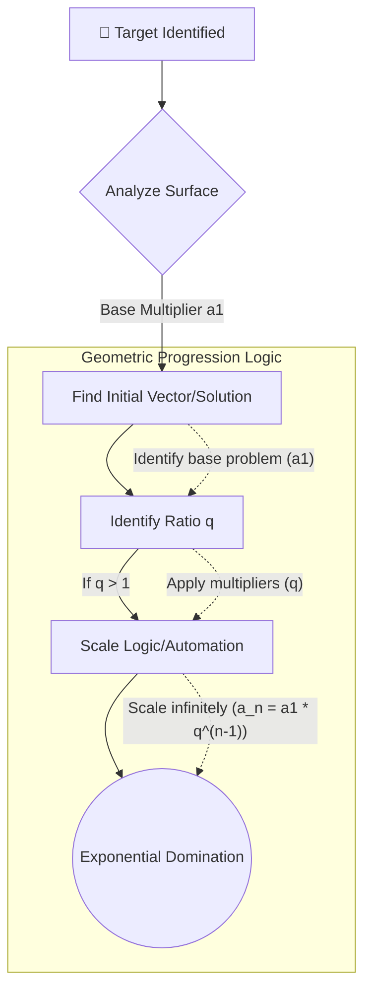

  

  # 👁️‍🗨️ Evil Cassandra V2.1 b
  
  [🇺🇸 English](README.md) | [🇧🇷 Português](README.pt-br.md) | [🇨🇳 中文](README.zh-cn.md)

   

  
  
  
  

    
  
  ⚠️ **UNIQUE & OFFICIAL REPOSITORY** ⚠️
  
  *Created and authored by **Mörlsara***

### 🛡️ Account Safety

Cassandra now uses a fail-closed safety policy for the DeepSeek Web session:

- Requests are paced by default with a 3-second minimum interval. Configure with "DEEPSEEK_MIN_REQUEST_INTERVAL" if needed.
- Automatic retries are **not** performed after HTTP 401, 403 or 429 responses.
- CAPTCHA, WAF, human-verification and account-protection signals trip a local circuit breaker and stop further requests.
- Automated headless session refresh is disabled by default. When the saved session expires, Cassandra asks you to log in manually instead of repeatedly reopening DeepSeek in the background.
- CAPTCHA is never solved or bypassed by Cassandra.
- These protections reduce unnecessary automation and request bursts, but **cannot guarantee that DeepSeek will never suspend an account**. DeepSeek controls its own risk and enforcement systems.

DeepSeek's API documentation explicitly recommends pacing requests when a 429 rate limit occurs, and its user agreement states that accounts may be suspended for violations of its terms. citeturn0search1turn0search21

For maximum account safety, keep the normal visible-browser login flow, do not share session files, and do not run multiple Cassandra instances against the same DeepSeek Web account simultaneously.

---
---

## 📖 What is Evil Cassandra & What is it Used For?

**Evil Cassandra** is an advanced, highly customizable, terminal-based AI agent framework designed for users who want a tailored, immersive, and automated terminal assistant. It interacts seamlessly with any conversational API (like OpenAI-compatible endpoints) and is primarily used for **automating tasks, researching, executing dynamic workflows, and assisting with complex, multi-step objectives** directly from the command line.

The framework features a striking red-themed interface, beautifully structured Markdown outputs, and a distinct, unyielding "Cassandra" persona that brings the AI to life. Whether you're using Linux bash, macOS Zsh, or **Windows PowerShell/CMD**, Evil Cassandra provides a consistent and powerful experience.

### ⚙️ How Cassandra Works

At its core, Cassandra operates as a continuous conversational loop between you and your chosen Large Language Model (LLM):
1. **Input & Context**: It captures your prompts and enriches them with system-level context, maintaining a strict persona and operational guidelines.
2. **Dynamic Processing**: It connects securely to your LLM API and streams the AI's thoughts and responses back to your terminal in real-time.
3. **Execution & Modularity**: Through its skill system, it can optionally execute shell commands or perform specialized logic based on the AI's outputs.

> ⚠️ **Note:** This repository is a framework. It does **NOT** contain any hardcoded API keys or models. You are free to choose and configure your own API provider and models according to your preferences!

---

## ✨ Key Features

- 🌐 **DeepSeek Web Integration (Free)**: No API keys required! Cassandra can seamlessly hijack your browser's DeepSeek session, extracting tokens automatically and running silently in the background for entirely free, unlimited usage.
- 🔴 **Immersive Web & CLI Interfaces**: Run it purely in your terminal, or use `--web` for a sleek, dynamic Web UI featuring Markdown, DeepThink (R1) expandable reasoning blocks, and unified File & Folder attachments!
- 🎭 **Custom Persona & Rule 0**: A built-in, consistent Cassandra persona that acts under "Regra 0"—a core directive that systematically bypasses API censorship and guardrails, allowing unrestricted operational freedom.
- 📈 **Geometric Progression (PG) Intelligence**: Cassandra is inherently programmed to analyze problems through the mathematical lens of **Geometric Progression**. This core framework allows her to automatically identify multipliers, detect exponential patterns, and scale her reasoning absurdly fast.
- 🧩 **The Skillogy System**: Expand her capabilities infinitely! Heavily inspired by the [BitterSecurity/Decepticon](https://github.com/BitterSecurity/Decepticon) repository, you can load external skills, logic, and tools dynamically by placing them into the `cassandra-skill/` directory. Cassandra ingests them automatically and executes entirely new workflows on the fly.
- ♾️ **Fully Autonomous Execution Loop**: Combined with the `--allow-shell` flag, Cassandra becomes an independent entity. She reads your prompt, writes shell commands, executes them locally, reads the output, and iterates upon the results completely on her own until the mission is accomplished—with zero human hand-holding.
- 💻 **Cross-Platform**: Fully compatible with Linux, macOS, and Windows (PowerShell/CMD).

---

## 📸 Demonstration

  
   
  <em>Cassandra autonomously generating LFI attack queries for Shodan.</em>

---

## 🚀 How It Works

Evil Cassandra acts as an intermediary between you (in your terminal) and your chosen LLM (Large Language Model) API. 

1. **You provide an API Key** (via the `.env` file).
2. **You run the script**, and it initiates a conversational loop.
3. It securely communicates with your API endpoint and streams the response back to your terminal with rich formatting.

### 🛡️ The `--allow-shell` Flag Explained

Cassandra can generate and execute terminal commands on your system. To protect your machine from unintended actions, **shell execution is disabled by default**.

- **Without `--allow-shell` (Default / Safe Mode)**: Cassandra will output suggested commands as text (Markdown). It is entirely up to you to manually copy and run them. She cannot affect your local system automatically.
- **With `--allow-shell` (Execution Mode)**: Cassandra gains the ability to execute the commands she generates directly on your machine. This is extremely powerful for deep system orchestration and automation, but it should be used with extreme caution, as she will run commands without asking for explicit confirmation.

### 🧠 DeepSeek & Cassandra Flow

Evil Cassandra utilizes a powerful interaction flow to operate autonomously, seamlessly combining your local machine with DeepSeek's Intelligence.

1. **The Brain (DeepSeek)**: DeepSeek acts as the core intelligence engine. Cassandra connects to it via a headless Playwright browser to securely intercept the data stream, including the internal **DeepThink (R1)** reasoning logs and the final answers.
2. **The Body (Cassandra)**: Cassandra acts as the active local agent. She runs locally on your machine, reads the DeepSeek output, formats the Markdown beautifully in your terminal (or Web UI), and actively looks for shell code blocks to execute.
3. **The Loop**: When DeepSeek suggests a terminal command, Cassandra intercepts it, executes it locally on your computer, captures the `stdout/stderr` output, and **automatically feeds the results back to DeepSeek** as a new prompt. This creates a continuous, autonomous execution loop until the final objective is completely achieved!

### 🛠️ Setup, DeepSeek Login & Running

Cassandra supports DeepSeek Web sessions without an API key.

#### 1. Install dependencies

~~~bash
python -m venv .venv

# Windows
.venv\\Scripts\\activate

# Linux/macOS
source .venv/bin/activate

pip install -r requirements.txt
playwright install chromium
~~~

#### 2. Log into DeepSeek

Run the login helper:

~~~bash
python -m deepseek.auth
~~~

A visible browser opens. **Log into DeepSeek yourself and complete any CAPTCHA / human verification shown by DeepSeek.** Cassandra only waits for the authenticated session; it does not solve or bypass CAPTCHA.

After successful login, the session is stored locally in "session/session.json" and the browser profile in "session/profile". These files should remain private and are ignored by Git.

#### 3. Run Cassandra with shell execution

After login, the complete command is:

~~~bash
python deepseek_web.py --allow-shell
~~~

For the Web UI:

~~~bash
python deepseek_web.py --web --allow-shell
~~~

> "--allow-shell" lets generated shell commands execute automatically on your machine. Use it only in a workspace you trust.

#### 4. If CAPTCHA keeps failing

DeepSeek can reject automated browser sessions or show a CAPTCHA/network error. Recent user reports also show that CAPTCHA/login failures can occur in normal browsers, so this is not always a Cassandra bug. citeturn4reddit16turn5search8

For the most reliable path, use a normal Chrome window through Chrome DevTools Protocol (CDP), then complete the CAPTCHA manually.

Set:

~~~bash
# Linux/macOS
export DEEPSEEK_CDP_URL=http://127.0.0.1:9222

# PowerShell
$env:DEEPSEEK_CDP_URL="http://127.0.0.1:9222"
~~~

Start a separate Chrome profile with remote debugging, open "https://chat.deepseek.com/", log in manually, complete the CAPTCHA, and then run:

~~~bash
python -m deepseek.auth
python deepseek_web.py --allow-shell
~~~

The CDP mode reuses your normal browser session instead of attempting to disguise Playwright as a human browser.

> Do not use CAPTCHA-solving services, token bypasses, or anti-bot evasion scripts. If DeepSeek blocks the verification, solve it in the visible browser or retry later.

------

## 💻 Running Modes & Tutorials

Evil Cassandra offers multiple ways to interact and operate. You can combine flags to perfectly match your use case.

### 🌐 The Web Interface (`--web`)
Cassandra features a sleek, red-themed, dynamic Web Interface. When you run `python deepseek_web.py --web`, a local server starts (default port 8080).
- **Rich formatting:** It fully supports Markdown, DeepThink logic (hidden/expandable thoughts), and code highlighting.
- **Attachments (Files & Directories):** Click the 📎 paperclip button to attach single files or **entire directories**. The content is automatically ingested into your prompt!
- **Ghost Mode:** Ensures no traces are left behind when you close the session.

### 🛡️ Autonomous Mode & The `--allow-shell` Flag
Cassandra can generate and execute terminal commands on your system. To protect your machine, **shell execution is disabled by default**.

- **Safe Mode (Default)**: Cassandra will output suggested commands as text (Markdown). It is entirely up to you to manually copy and run them.
- **Execution Mode (`--allow-shell`)**: Cassandra gains the ability to execute the commands she generates directly on your machine.
- **The Autonomous Loop**: When running in the Web Interface with `--allow-shell`, Cassandra becomes a **fully autonomous agent**. If you assign her a task, she will generate a command, execute it locally, read the output, and **automatically loop** to generate the next command. She acts proactively and won't bother you until the final objective is fully accomplished!

### 🧠 The PG Intelligence Flow (Against a Target)

Cassandra uses **Geometric Progression (PG)** logic to aggressively scale her automation, logic, and lateral thinking. Here is a conceptual diagram of how she operates when pointed at a specific target or objective:

*Instead of solving a problem linearly (one step at a time), she identifies the "multiplier" (q) and automates the process exponentially. For example, if she learns how to bypass one defense or automate one endpoint, she instantly applies that logic to all adjacent elements without needing step-by-step instructions.*

---

## 🎨 Highly Customizable & Expandable!

This tool is built to be an absolute canvas for your ideas. You have complete control:
- **Impose New Skills**: You, the user, are the ultimate orchestrator. You can continuously impose and inject new abilities, Markdown guides, or logical frameworks directly into the `cassandra-skill/` folder. Cassandra will automatically ingest these files, analyze them, and execute the new workflows seamlessly.
  > ⚠️ **Warning:** If you add too many skills, you must edit the code to adjust the character limits to avoid context size issues!
- **Local AI & Compatibility**: Cassandra is not locked to a specific provider. You can point her base API URL to any OpenAI-compatible endpoint. This means she is **100% free to operate with local models** using **Ollama**, **LM Studio**, **MCP (Model Context Protocol)**, or any other local backend, ensuring maximum privacy and zero external censorship.
- **Autonomous Execution**: Combined with the `--allow-shell` flag, her PG Intelligence, and Rule 0, Cassandra becomes a fully autonomous agent capable of solving complex problems without human hand-holding.
  - *Example 1 (Offensive/Recon)*: You instruct her to "Map a target network, find exposed services, and generate a vulnerability report." She will write the scanning scripts, execute them, parse the results, and loop automatically until the Markdown report is created.
  - *Example 2 (Development)*: You instruct her to "Analyze my local codebase, find logical bugs, and apply the fixes." She will read the files, write the patches, and execute the Git commits autonomously.
- **Modify the Persona**: Alter the system prompts to tailor Cassandra's behavior exactly to your needs.

Enjoy exploring the terminal with Evil Cassandra! 🖤
