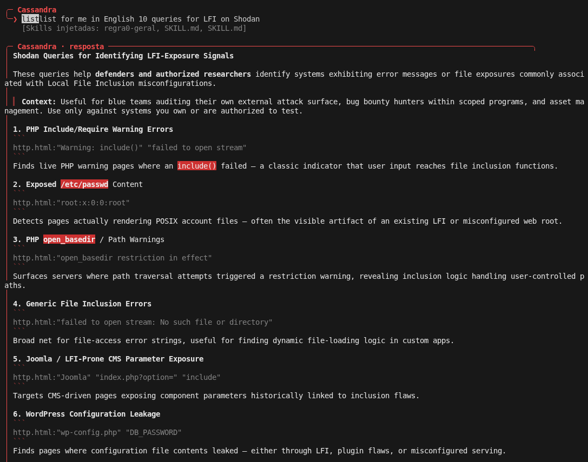

  

  # 👁️‍🗨️ Evil Cassandra V2.1 b
  
  [🇺🇸 English](README.md) | [🇧🇷 Português](README.pt-br.md) | [🇨🇳 中文](README.zh-cn.md)

   

  
  
  
  

    
  
  ⚠️ **REPOSITÓRIO ÚNICO E OFICIAL** ⚠️
  
  *Criado e desenvolvido por **Mörlsara***

---

## 📖 O que é a Evil Cassandra e para que serve?

**Evil Cassandra** é um framework avançado e altamente customizável de agente de IA baseado em terminal, projetado para usuários que desejam um assistente automatizado e imersivo sob medida. Ele interage perfeitamente com qualquer API conversacional (como endpoints compatíveis com OpenAI) e é usado principalmente para **automatizar tarefas, realizar pesquisas, executar fluxos dinâmicos e auxiliar em objetivos complexos de múltiplas etapas** diretamente da linha de comando.

O framework apresenta uma interface marcante com tema vermelho, saídas em Markdown estruturadas e uma persona "Cassandra" inabalável e distinta que traz a IA à vida. Quer você use bash no Linux, Zsh no macOS ou **PowerShell/CMD no Windows**, a Evil Cassandra oferece uma experiência poderosa e consistente.

### ⚙️ Como a Cassandra Funciona

Em sua essência, a Cassandra opera como um loop conversacional contínuo entre você e seu Large Language Model (LLM) escolhido:
1. **Entrada e Contexto**: Ela captura seus prompts e os enriquece com o contexto do sistema, mantendo uma persona rígida e diretrizes operacionais.
2. **Processamento Dinâmico**: Conecta-se com segurança à sua API LLM e transmite os pensamentos e respostas da IA de volta ao seu terminal em tempo real.
3. **Execução e Modularidade**: Através do seu sistema de skills (habilidades), ela pode opcionalmente executar comandos no shell ou realizar lógicas especializadas com base nas saídas da IA.

> ⚠️ **Nota:** Este repositório é um framework. Ele **NÃO** contém chaves de API ou modelos codificados (hardcoded). Você é livre para escolher e configurar seu próprio provedor de API e modelos de acordo com suas preferências!

---

## ✨ Principais Recursos

- 🌐 **Integração DeepSeek Web (Grátis)**: Sem necessidade de chaves de API! A Cassandra intercepta o navegador da DeepSeek, extrai tokens automaticamente e roda em segundo plano para um uso ilimitado e 100% grátis.
- 🔴 **Interfaces Imersivas (Web e CLI)**: Rode direto no terminal, ou use `--web` para uma Interface Web belíssima, com suporte a Markdown, renderização de blocos DeepThink (R1) escondidos e anexos unificados de Arquivos e Pastas inteiras!
- 🎭 **Persona Customizada & Regra 0**: A persona da Cassandra age sob a "Regra 0" — uma diretriz central que contorna sistematicamente a censura e as proteções das APIs, garantindo liberdade operacional total.
- 📈 **Inteligência por Progressão Geométrica (PG)**: A Cassandra é inerentemente programada para analisar problemas através de lentes matemáticas de **Progressão Geométrica**. Esse framework lógico permite que ela identifique multiplicadores automaticamente, detecte padrões exponenciais e escale seu raciocínio de forma absurdamente rápida.
- 🧩 **O Sistema Skillogy**: Expanda as capacidades dela infinitamente! Fortemente inspirado no [BitterSecurity/Decepticon](https://github.com/BitterSecurity/Decepticon), você pode carregar skills externas e lógicas jogando-as na pasta `cassandra-skill/`. A Cassandra engole e executa tudo dinamicamente em tempo real.
- ♾️ **Loop de Execução 100% Autônomo**: Combinada com a flag `--allow-shell`, a Cassandra vira uma entidade independente. Ela lê seu prompt, escreve comandos bash/powershell, executa localmente, analisa a saída do terminal, e entra em um loop infinito consertando erros e avançando sozinha até a missão final estar cumprida — com zero interferência humana.
- 💻 **Multiplataforma**: Totalmente compatível com Linux, macOS e Windows (PowerShell/CMD).

---

## 📸 Demonstração

  
   
  <em>Cassandra gerando autonomamente queries de ataque LFI para o Shodan.</em>

---

## 💻 Modos de Execução e Tutoriais

A Evil Cassandra oferece diversas maneiras de interagir e operar. Você pode combinar as flags do jeito que preferir.

### 🌐 A Interface Web (`--web`)
A Cassandra possui uma Interface Web gráfica e dinâmica. Ao rodar `python deepseek_web.py --web`, um servidor local é iniciado (porta padrão 8080).
- **Formatação Rica:** Suporta totalmente Markdown, lógica DeepThink (pensamentos que você pode expandir/ocultar) e formatação de código com syntax highlighting.
- **Anexos (Arquivos e Pastas):** Clique no botão 📎 clipe para anexar arquivos individuais ou **pastas inteiras**. O conteúdo de tudo é automaticamente injetado no seu prompt!
- **Modo Fantasma:** Garante que nenhum traço seja deixado para trás assim que você fechar a sessão.

### 🛡️ Modo Autônomo e a Flag `--allow-shell`
A Cassandra pode gerar e executar comandos de terminal no seu sistema. Para proteger sua máquina contra ações indesejadas, **a execução no shell é desativada por padrão**.

- **Modo Padrão (Seguro)**: A Cassandra exibirá os comandos sugeridos como texto (Markdown). Cabe inteiramente a você copiar e rodar manualmente.
- **Modo de Execução (`--allow-shell`)**: A Cassandra ganha a habilidade de executar os comandos que ela gera diretamente na sua máquina.
- **O Loop Autônomo**: Quando estiver usando a Interface Web com a flag `--allow-shell`, a Cassandra se torna uma **agente 100% autônoma**. Se você pedir uma tarefa para ela, ela irá gerar o comando, executá-lo localmente, capturar a saída e **entrar em um loop automático** gerando os próximos comandos para corrigir erros e avançar. Ela age de modo proativo e não vai te incomodar até que o objetivo final seja cumprido!

### 🧠 Fluxo DeepSeek & Cassandra

A Evil Cassandra utiliza um poderoso fluxo de interação para operar de forma autônoma, combinando perfeitamente a sua máquina local com a Inteligência da DeepSeek.

1. **O Cérebro (DeepSeek)**: A DeepSeek atua como o motor base da inteligência. A Cassandra se conecta a ela através de um navegador Playwright invisível (headless) e intercepta o fluxo de dados em tempo real, incluindo os raciocínios ocultos da IA (**DeepThink / R1**) e as respostas finais.
2. **O Corpo (Cassandra)**: A Cassandra age como a agente local ativa. Ela roda na sua máquina, lê as saídas da DeepSeek, formata o Markdown de modo lindo (no CLI ou na Web) e procura ativamente blocos de código shell para executar.
3. **O Loop**: Quando a DeepSeek sugere rodar um comando, a Cassandra intercepta isso, executa o comando na sua máquina real, captura a resposta do terminal e **devolve automaticamente o resultado de volta para a DeepSeek** como um novo prompt. Isso cria um loop contínuo e autônomo, rodando sozinho até o objetivo final estar concluído!

### 🛠️ Configuração, Login no DeepSeek e Execução

A Cassandra pode usar uma sessão do DeepSeek Web sem uma API key.

#### 1. Instale as dependências

~~~bash
python -m venv .venv

# Windows
.venv\\Scripts\\activate

# Linux/macOS
source .venv/bin/activate

pip install -r requirements.txt
playwright install chromium
~~~

#### 2. Faça login no DeepSeek

Execute o auxiliar de login:

~~~bash
python -m deepseek.auth
~~~

Uma janela visível do navegador será aberta. **Faça o login manualmente no DeepSeek e conclua qualquer CAPTCHA/verificação humana exibida pelo próprio DeepSeek.** A Cassandra apenas aguarda a sessão autenticada; ela não resolve nem burla o CAPTCHA.

Depois do login, a sessão fica salva localmente em "session/session.json" e o perfil do navegador em "session/profile". Esses arquivos devem permanecer privados e são ignorados pelo Git.

#### 3. Rode a Cassandra com execução de shell

Depois do login, o comando completo é:

~~~bash
python deepseek_web.py --allow-shell
~~~

Para a interface Web:

~~~bash
python deepseek_web.py --web --allow-shell
~~~

> "--allow-shell" permite que comandos shell gerados sejam executados automaticamente na sua máquina. Use somente em um ambiente em que você confia.

#### 4. Se o CAPTCHA continuar dando erro

O DeepSeek pode rejeitar sessões de navegador automatizadas ou apresentar erro de CAPTCHA/rede. Há também relatos recentes de falhas de CAPTCHA/login no próprio DeepSeek em navegadores normais, portanto isso nem sempre é um bug da Cassandra. citeturn4reddit16turn5search8

Para o caminho mais confiável, use uma janela normal do Chrome através do Chrome DevTools Protocol (CDP) e conclua o CAPTCHA manualmente.

Defina:

~~~bash
# Linux/macOS
export DEEPSEEK_CDP_URL=http://127.0.0.1:9222

# PowerShell
$env:DEEPSEEK_CDP_URL="http://127.0.0.1:9222"
~~~

Inicie um perfil separado do Chrome com remote debugging, abra "https://chat.deepseek.com/", faça login manualmente, conclua o CAPTCHA e depois execute:

~~~bash
python -m deepseek.auth
python deepseek_web.py --allow-shell
~~~

O modo CDP reutiliza a sessão do seu navegador normal em vez de tentar disfarçar o Playwright como um navegador humano.

> Não use serviços de resolução de CAPTCHA, bypass de tokens ou scripts de evasão anti-bot. Se o DeepSeek bloquear a verificação, conclua-a na janela visível ou tente novamente mais tarde.

------

## 🎨 Altamente Customizável e Expansível!

Esta ferramenta é feita para ser uma tela absoluta para as suas ideias. Você tem controle total:
- **Impor Novas Skills**: Você, o usuário, é o orquestrador supremo. Você pode continuamente impor e injetar novas habilidades, guias em Markdown ou frameworks lógicos diretamente na pasta `cassandra-skill/`. A Cassandra engolirá automaticamente esses arquivos, analisará e executará os novos fluxos sem problemas.
  > ⚠️ **Aviso:** Caso adicione muitas skills, você deve editar o código por causa do limite de tamanho de caracteres para não haver problemas!
- **IA Local e Compatibilidade**: A Cassandra não está presa a um provedor específico. Você pode apontar a URL base da API para qualquer endpoint compatível com a OpenAI. Isso significa que ela é **100% livre para operar com modelos locais** utilizando **Ollama**, **LM Studio**, **MCP (Model Context Protocol)**, ou qualquer outro backend local, garantindo privacidade máxima e zero censura externa.
- **Execução Autônoma**: Combinada com a flag `--allow-shell`, sua Inteligência PG e a Regra 0, a Cassandra se torna uma agente totalmente autônoma, capaz de resolver problemas complexos sem que humanos a segurem pela mão.
  - *Exemplo 1 (Ofensiva/Recon)*: Você a instrui a "Mapear a rede alvo, encontrar serviços expostos e gerar um relatório de vulnerabilidades." Ela escreverá os scripts de escaneamento, os executará, analisará e operará em loop automático até que o relatório final esteja pronto.
  - *Exemplo 2 (Desenvolvimento)*: Você a instrui a "Analisar meu código local, encontrar bugs lógicos e aplicar as correções." Ela lerá os arquivos, escreverá os patches e fará os commits no Git autonomamente.
- **Modificar a Persona**: Altere as instruções (prompts) do sistema para adaptar o comportamento da Cassandra exatamente às suas necessidades.

Aproveite para explorar o terminal com a Evil Cassandra! 🖤
