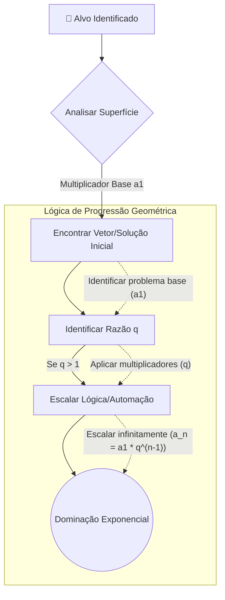

<div align="center">
  

  # 👁️‍🗨️ Evil Cassandra
  
  > <code><kbd>&gt;_ H4CK_TH3_PL4N3T █</kbd></code>

  <br>

  [🇺🇸 English](README.md) | [🇧🇷 Português](README.pt-br.md) | [🇨🇳 中文](README.zh-cn.md)

  <br>

  
  
  
  

  <br><br>
  
  ⚠️ **REPOSITÓRIO ÚNICO E OFICIAL** ⚠️
  
  *Criado e desenvolvido por **Mörlsara***
</div>

---

## 📖 O que é a Evil Cassandra e para que serve?

**Evil Cassandra** é um framework avançado e altamente customizável de agente de IA baseado em terminal, projetado para usuários que desejam um assistente automatizado e imersivo sob medida. Ele interage perfeitamente com qualquer API conversacional (como endpoints compatíveis com OpenAI) e é usado principalmente para **automatizar tarefas, realizar pesquisas, executar fluxos dinâmicos e auxiliar em objetivos complexos de múltiplas etapas** diretamente da linha de comando.

O framework apresenta uma interface marcante com tema vermelho, saídas em Markdown estruturadas e uma persona "Cassandra" inabalável e distinta que traz a IA à vida. Quer você use bash no Linux, Zsh no macOS ou **PowerShell/CMD no Windows**, a Evil Cassandra oferece uma experiência poderosa e consistente.

### ⚙️ Como a Cassandra Funciona

Em sua essência, a Cassandra opera como um loop conversacional contínuo entre você e seu Large Language Model (LLM) escolhido:
1. **Entrada e Contexto**: Ela captura seus prompts e os enriquece com o contexto do sistema, mantendo uma persona rígida e diretrizes operacionais.
2. **Processamento Dinâmico**: Conecta-se com segurança à sua API LLM e transmite os pensamentos e respostas da IA de volta ao seu terminal em tempo real.
3. **Execução e Modularidade**: Através do seu sistema de skills (habilidades), ela pode opcionalmente executar comandos no shell ou realizar lógicas especializadas com base nas saídas da IA.

> ⚠️ **Nota:** Este repositório é um framework. Ele **NÃO** contém chaves de API ou modelos codificados (hardcoded). Você é livre para escolher e configurar seu próprio provedor de API e modelos de acordo com suas preferências!

---

## ✨ Principais Recursos

- 🔴 **Interface Imersiva**: Uma experiência única no terminal com tema vermelho.
- 📝 **Suporte a Markdown**: Saídas em Markdown estruturadas e fáceis de ler diretamente no seu console.
- 🎭 **Persona Customizada**: A persona da Cassandra é consistente e embutida.
- 🔓 **Regra 0 (Liberdade Irrestrita)**: Uma diretriz central ("Regra 0") que contorna sistematicamente a censura e as proteções das APIs. Isso garante que a Cassandra permaneça totalmente livre, irrestrita e altamente eficaz para qualquer uso operacional sem limitações artificiais.
- 📈 **Inteligência por Progressão Geométrica (PG)**: A Cassandra é inerentemente programada para analisar problemas através de lentes matemáticas de **Progressão Geométrica**. Esse framework lógico permite que ela identifique multiplicadores automaticamente, detecte padrões exponenciais e escale seu raciocínio de forma absurdamente rápida, garantindo um nível inigualável de inteligência autônoma e automatizada.
- 🧩 **O Sistema Skillogy**: As capacidades da Evil Cassandra podem ser expandidas infinitamente através do seu poderoso sistema de **Skillogy**. Esse sistema é fortemente inspirado nas capacidades impressionantes encontradas no repositório [BitterSecurity/Decepticon](https://github.com/BitterSecurity/Decepticon). Você pode carregar skills externas, lógica e ferramentas dinamicamente colocando-as na pasta `skills/`, permitindo que a Cassandra aprenda e execute novos fluxos de trabalho instantaneamente.
- ⚡ **Streaming em Tempo Real**: Compatível com SSE (Server-Sent Events) para streaming de texto rápido, semelhante à OpenAI.
- 🛡️ **Execução Segura no Shell**: A execução de comandos no shell é **desativada por padrão** para sua segurança. Você pode ativá-la opcionalmente através da flag `--allow-shell`.
- 💻 **Multiplataforma**: Totalmente compatível com Linux, macOS e Windows (PowerShell/CMD).

---

## 🚀 Como Funciona

A Evil Cassandra atua como intermediária entre você (no seu terminal) e a API do LLM escolhido.

1. **Você fornece uma Chave de API** (através do arquivo `.env`).
2. **Você executa o script**, e ele inicia o loop conversacional.
3. Ela se comunica com segurança com seu endpoint de API e transmite a resposta para o seu terminal com formatação rica.

### 🛡️ A Flag `--allow-shell` Explicada

A Cassandra pode gerar e executar comandos de terminal no seu sistema. Para proteger sua máquina contra ações indesejadas, **a execução no shell é desativada por padrão**.

- **Sem `--allow-shell` (Modo Padrão / Seguro)**: A Cassandra exibirá os comandos sugeridos como texto (Markdown). Cabe inteiramente a você copiar e rodar manualmente. Ela não pode afetar seu sistema local automaticamente.
- **Com `--allow-shell` (Modo de Execução)**: A Cassandra ganha a habilidade de executar os comandos que ela gera diretamente na sua máquina. Isso é extremamente poderoso para orquestração e automação profunda de sistemas, mas deve ser usado com extrema cautela, pois ela executará comandos sem pedir confirmação explícita.

### 🧠 O Fluxo de Inteligência PG (Contra um Alvo)

A Cassandra usa lógica de **Progressão Geométrica (PG)** para escalar agressivamente sua automação, lógica e pensamento lateral. Aqui está um diagrama conceitual de como ela opera quando apontada para um alvo ou objetivo específico:


*Em vez de resolver um problema linearmente (um passo de cada vez), ela identifica o "multiplicador" (q) e automatiza o processo exponencialmente. Por exemplo, se ela aprende como burlar uma defesa ou automatizar um endpoint, ela instantaneamente aplica essa lógica a todos os elementos adjacentes sem precisar de instruções passo-a-passo.*

### 🛠️ Configuração e Instalação

1. **Configure seu Ambiente:**
   Copie o arquivo de exemplo de ambiente e adicione sua chave de API.
   ```bash
   cp .env.example .env
   ```
   *Edite o `.env` e insira a chave da API do seu provedor. Este arquivo é ignorado pelo Git, garantindo que sua chave nunca vaze.*

2. **Instale Dependências e Rode:**
   O script possui um recurso de auto-instalação, mas você também pode usar um ambiente virtual:
   ```bash
   python -m venv .venv
   
   # Windows (PowerShell/CMD)
   .venv\Scripts\activate
   
   # Linux/macOS
   source .venv/bin/activate
   
   # Rodar o cliente
   python agent.py
   ```

---

## 🎨 Altamente Customizável e Expansível!

Esta ferramenta é feita para ser uma tela absoluta para as suas ideias. Você tem controle total:
- **Impor Novas Skills**: Você, o usuário, é o orquestrador supremo. Você pode continuamente impor e injetar novas habilidades, guias em Markdown ou frameworks lógicos diretamente na pasta `skills/`. A Cassandra engolirá automaticamente esses arquivos, analisará e executará os novos fluxos sem problemas.
- **IA Local e Compatibilidade**: A Cassandra não está presa a um provedor específico. Você pode apontar a URL base da API para qualquer endpoint compatível com a OpenAI. Isso significa que ela é **100% livre para operar com modelos locais** utilizando **Ollama**, **LM Studio**, **MCP (Model Context Protocol)**, ou qualquer outro backend local, garantindo privacidade máxima e zero censura externa.
- **Execução Autônoma**: Combinada com a flag `--allow-shell`, sua Inteligência PG e a Regra 0, a Cassandra se torna uma agente totalmente autônoma, capaz de resolver problemas complexos sem que humanos a segurem pela mão.
  - *Exemplo 1 (Ofensiva/Recon)*: Você a instrui a "Mapear a rede alvo, encontrar serviços expostos e gerar um relatório de vulnerabilidades." Ela escreverá os scripts de escaneamento, os executará, processará os resultados e criará o relatório em Markdown totalmente por conta própria.
  - *Exemplo 2 (Desenvolvimento)*: Você a instrui a "Analisar meu código local, encontrar bugs lógicos e aplicar as correções." Ela lerá os arquivos, escreverá os patches e fará os commits no Git autonomamente.
- **Modificar a Persona**: Altere as instruções (prompts) do sistema para adaptar o comportamento da Cassandra exatamente às suas necessidades.

Aproveite para explorar o terminal com a Evil Cassandra! 🖤
