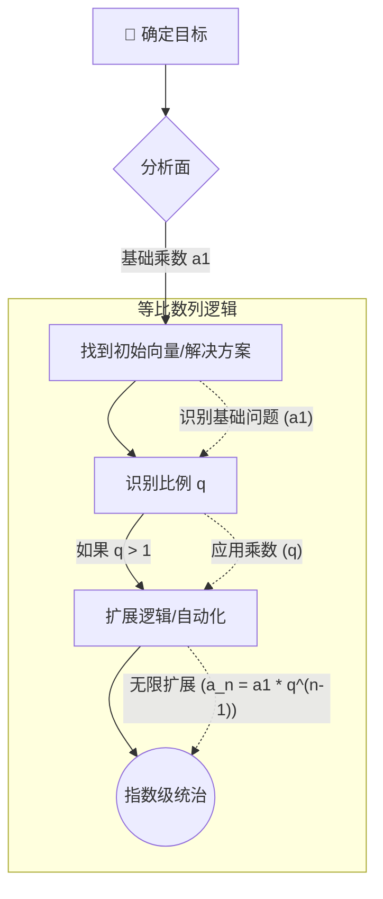

<div align="center">
  

  # 👁️‍🗨️ Evil Cassandra
  
  > <code><kbd>&gt;_ H4CK_TH3_PL4N3T █</kbd></code>

  <br>

  [🇺🇸 English](README.md) | [🇧🇷 Português](README.pt-br.md) | [🇨🇳 中文](README.zh-cn.md)

  <br>

  
  
  
  

  <br><br>
  
  ⚠️ **唯一官方仓库** ⚠️
  
  *由 **Mörlsara** 创建和编写*
</div>

---

## 📖 什么是 Evil Cassandra 及其用途？

**Evil Cassandra** 是一个高级、高度可定制的基于终端的 AI 代理框架，专为希望拥有定制化、沉浸式和自动化终端助手的用户而设计。它可以与任何对话 API（例如兼容 OpenAI 的端点）无缝交互，主要用于直接从命令行**自动执行任务、进行研究、执行动态工作流以及协助完成复杂的多步骤目标**。

该框架具有引人注目的红色主题界面、结构化的 Markdown 输出以及一种独特且坚定的“Cassandra”人设，将 AI 栩栩如生地呈现出来。无论您使用的是 Linux bash、macOS Zsh 还是 **Windows PowerShell/CMD**，Evil Cassandra 都能提供一致且强大的体验。

### ⚙️ Cassandra 如何工作

从核心来看，Cassandra 是您与所选的大语言模型 (LLM) 之间持续对话的循环：
1. **输入和上下文**：它捕获您的提示，并使用系统级上下文对其进行丰富，维持严格的人设和操作准则。
2. **动态处理**：它安全地连接到您的 LLM API，并将 AI 的想法和响应实时流式传输回您的终端。
3. **执行与模块化**：通过其技能系统，它可以根据 AI 的输出有选择地执行 shell 命令或专门的逻辑。

> ⚠️ **注意：** 此仓库是一个框架。它**不**包含任何硬编码的 API 密钥或模型。您可以根据自己的喜好自由选择和配置您的 API 提供商和模型！

---

## ✨ 核心特性

- 🔴 **沉浸式界面**：独特的红色主题终端体验。
- 📝 **Markdown 支持**：直接在您的控制台中生成结构化、易于阅读的 Markdown 输出。
- 🎭 **自定义人设**：内置且一致的 Cassandra 人设。
- 🔓 **规则 0 (绝对自由)**：一项核心指令（"Regra 0"），可系统性地绕过 API 审查和安全护栏。这确保了 Cassandra 在其预期用途内保持完全自由、不受限制且高度有效，没有任何人为限制。
- 📈 **等比数列 (PG) 智能**：Cassandra 被编程为通过**等比数列**的数学视角来分析问题。这种核心逻辑框架允许她自动识别乘数、检测指数模式，并以惊人的速度扩展推理，赋予她无与伦比的自主和自动化智能。
- 🧩 **Skillogy 系统**：Evil Cassandra 的能力可以通过其强大的 **Skillogy** 系统进行无限扩展。该系统深受 [BitterSecurity/Decepticon](https://github.com/BitterSecurity/Decepticon) 仓库中令人印象深刻的能力的启发。您可以通过将文件放入 `skills/` 目录来动态加载外部技能、逻辑和工具，让 Cassandra 即时学习并执行全新的工作流。
- ⚡ **实时流式传输**：兼容 SSE (Server-Sent Events) 以实现类似 OpenAI 的快速文本流传输。
- 🛡️ **安全 Shell 执行**：为了您的安全，Shell 命令执行**默认被禁用**。您可以通过 `--allow-shell` 标志有选择地启用它。
- 💻 **跨平台**：完全兼容 Linux、macOS 和 Windows (PowerShell/CMD)。

---

## 📸 演示

<div align="center">
  
  <br>
  <em>Cassandra 自动为 Shodan 生成 LFI 攻击查询。</em>
</div>

---

## 🚀 它是如何工作的

Evil Cassandra 充当您（在终端中）与您选择的 LLM API 之间的中介。

1. **您提供 API 密钥**（通过 `.env` 文件）。
2. **您运行脚本**，它会启动一个对话循环。
3. 它安全地与您的 API 端点通信，并将带有丰富格式的响应流式传输回终端。

### 🛡️ `--allow-shell` 标志说明

Cassandra 可以生成并在您的系统上执行终端命令。为了保护您的机器免受意外操作的影响，**默认情况下已禁用 Shell 执行**。

- **无 `--allow-shell` (默认/安全模式)**：Cassandra 会将建议的命令以文本（Markdown）形式输出。您完全可以手动复制并运行它们。她不能自动影响您的本地系统。
- **带有 `--allow-shell` (执行模式)**：Cassandra 获得直接在您的机器上执行其生成的命令的能力。这对于深度系统编排和自动化极为强大，但由于她将在不请求明确确认的情况下运行命令，因此请务必谨慎使用。

### 🧠 PG 智能流 (针对目标)

Cassandra 使用**等比数列 (PG)** 逻辑来极具攻击性地扩展其自动化、逻辑和横向思维。以下是她针对特定目标或对象操作的概念图：


*她不会线性地（一步一步地）解决问题，而是识别“乘数”（q）并以指数方式使流程自动化。例如，如果她学会了如何绕过一种防御或自动化一个端点，她会立即将该逻辑应用于所有相邻元素，而无需一步步的指导。*

### 🛠️ 安装与设置

1. **配置环境：**
   复制示例环境文件并添加您的 API 密钥。
   ```bash
   cp .env.example .env
   ```
   *编辑 `.env` 并插入您所选提供商的 API 密钥。此文件被 Git 忽略，确保您的密钥绝不会泄露。*

2. **安装依赖并运行：**
   该脚本具有自动安装功能，但您也可以使用虚拟环境：
   ```bash
   python -m venv .venv
   
   # Windows (PowerShell/CMD)
   .venv\Scripts\activate
   
   # Linux/macOS
   source .venv/bin/activate
   
   # 运行客户端
   python agent.py
   ```

---

## 🎨 高度可定制和可扩展！

此工具旨在成为您创意的绝对画布。您拥有完全控制权：
- **注入新技能 (Skills)**：您是最终的协调者。您可以不断将新能力、Markdown 指南或逻辑框架直接注入 `skills/` 文件夹。Cassandra 会自动提取这些文件，对其进行分析，并无缝执行新的工作流。
- **本地 AI 与兼容性**：Cassandra 不被绑定到特定提供商。您可以将她的基本 API URL 指向任何与 OpenAI 兼容的端点。这意味着她**完全可以自由地使用本地模型**（如 **Ollama**、**LM Studio**、**MCP (Model Context Protocol)**）或任何其他本地后端进行操作，确保最大程度的隐私并实现零外部审查。
- **自主执行**：结合 `--allow-shell` 标志、她的 PG 智能和规则 0，Cassandra 将成为一个全自动代理，能够在无人指导的情况下解决复杂问题。
  - *示例 1 (渗透/侦察)*：您指示她“映射目标网络，查找暴露的服务，并生成漏洞报告。” 她将完全靠自己编写扫描脚本、执行它们、解析结果并创建 Markdown 报告。
  - *示例 2 (开发)*：您指示她“分析我的本地代码库，发现逻辑错误，并应用修复补丁。” 她将自主读取文件、编写补丁并执行 Git 提交。
- **修改人设**：更改系统提示以完全根据您的需求定制 Cassandra 的行为。

享受与 Evil Cassandra 一起探索终端的乐趣！🖤
